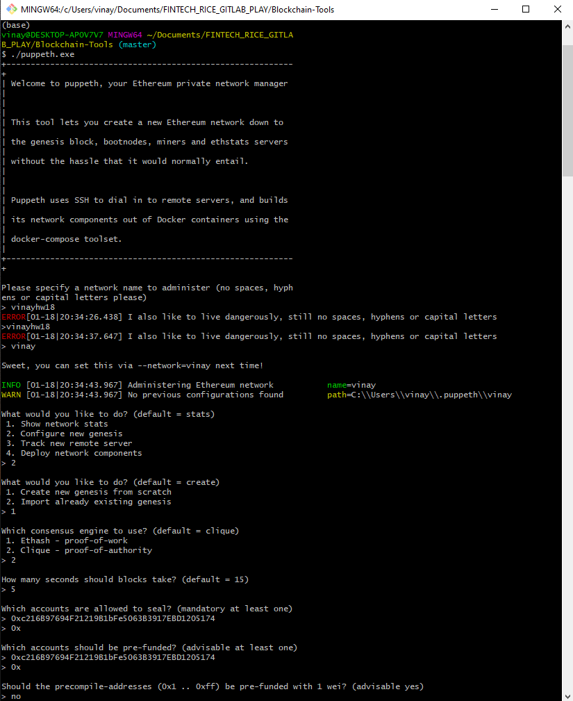
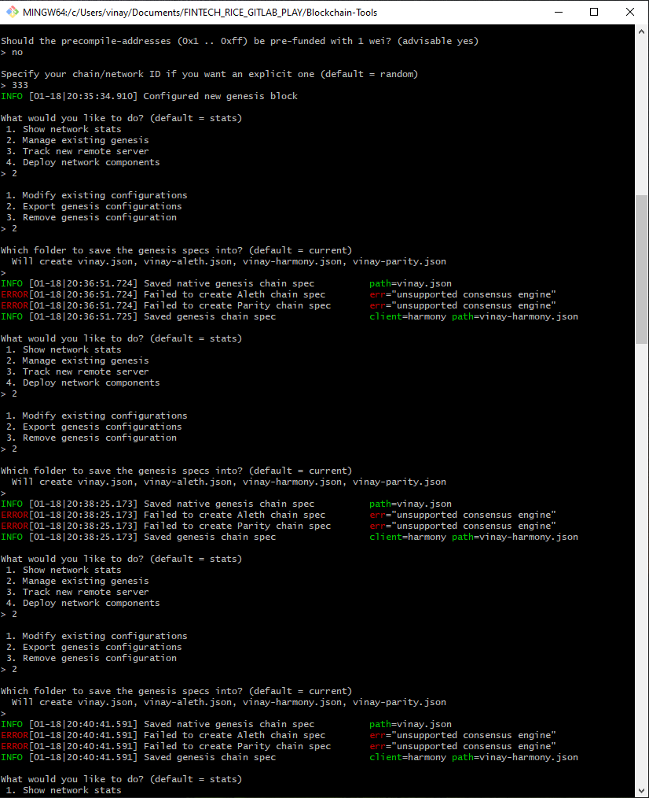
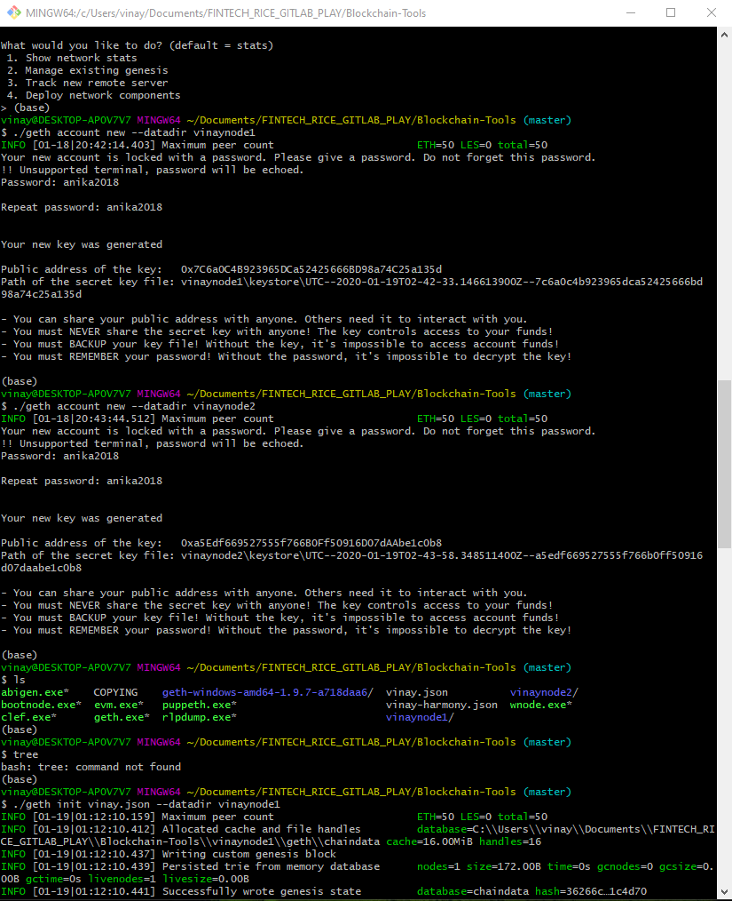
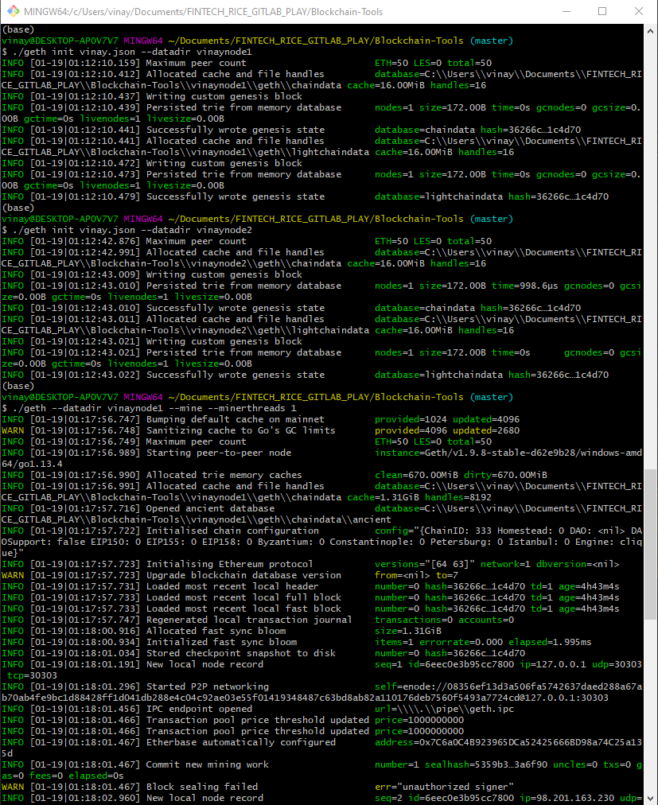
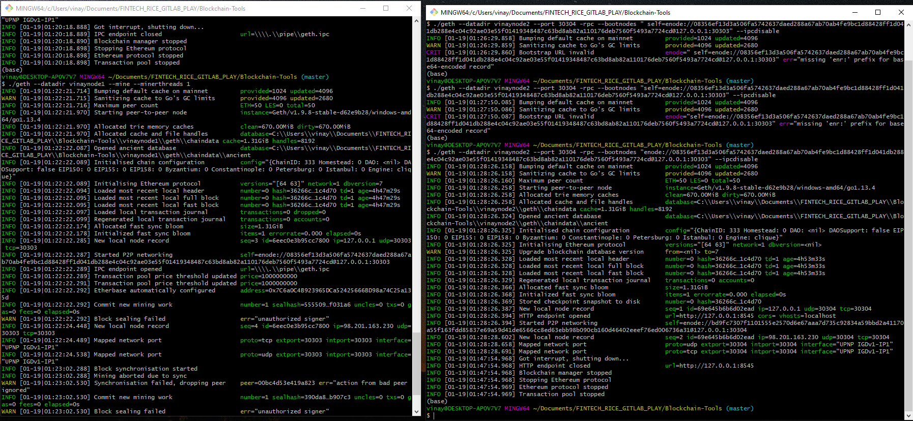
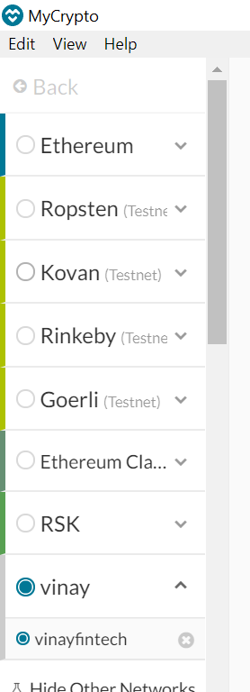
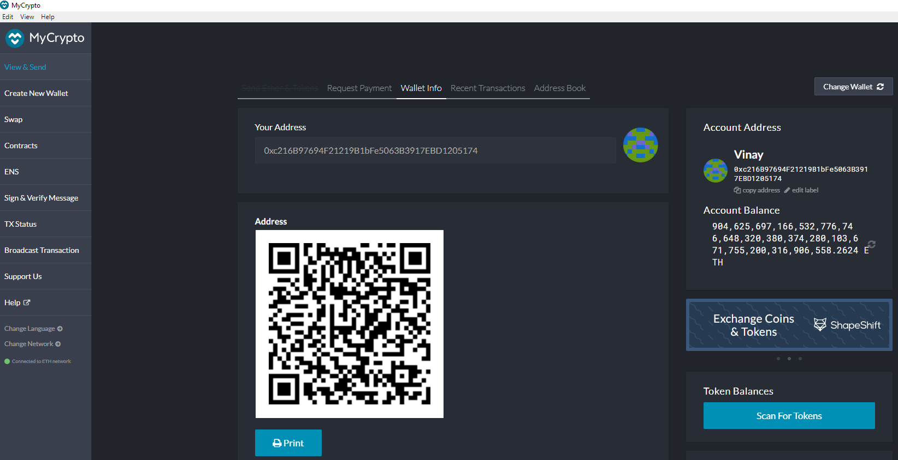

# Week 18 HW - Custom Blockchain on Kovan Test Network

* Name: *Vinay Kakuru*
* Assignment: *Blockchain - Week 18*
* Summary: *Purpose of this assignment is to create a custom blockchain with 2 test nodes deployed on custom test network, and use MyCrypto wallet to send & confrim a transaction*

## My Steps and Screen-Shots

1) Run below command to setup a private Ethereum network
    ```
      ./puppeth.exe
    ```
    

2) My network name is "Vinay"
3) Configured a genesis block from 'Scratch'
4) Used Proof of Authority
5) Used 5 sec. for each block generation
6) Used address 0x216B9... to seal the block
7) Used address 0x216B9... to pre-fund
8) No pre-compiled addresses were funded
    
9) Used 333 for Network id
10) Exported the genesis block to same folder
11) Run below command to create the first node 
    ```
      ./geth account new --datadir vinaynode1
    ```
    
12) Run below command to create the second node
    ```
      ./geth account new --datadir vinaynode2
    ```
11) Run below command to initialize the first node 
    ```
      ./geth init vinay.json --datadir vinaynode1
    ```
    
12) Run below command to initialize the second node
    ```
      ./geth init vinay.json --datadir vinaynode1
    ```
13) Run below command to setup the second node
    ```
    ./geth init vinay.json --datadir vinaynode1
    ```
14) Mine both nodes using 2 seperate consoles
    

15) My custom blockchain "Vinay -> vinayfintech"

    

16) My Prefunded Wallet Address with lots of Ether!

    